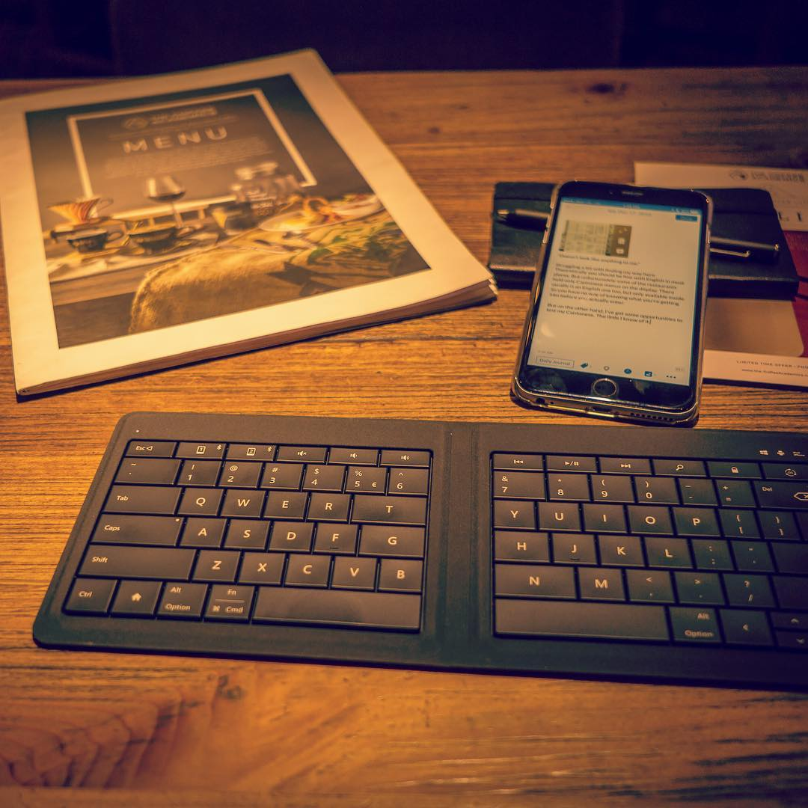

It started with the iPad. “When I get it, I will finally have the right tool for my writing.”

I got it, I put a few entries on [my Polish personal finance blog](https://metafinanse.pl) and then my interest in it waned. I'm still using it as a note-taking tablet, a task-management tool, and overall “productivity” machine. And of course - content consumption.

But less and less so for content creation.

It doesnt’t feel like a right (or perhaps the better word is “perfect”) machine for that. For me, that is. You totally can do work on an iPad, and writing is probably the most fitting one for Apple’s tablet... but the (minor) limitations and annoyances spoil the experience for me. So I turned my gaze to the Mac. “Once I have a *real* computer, I will finally be able to write”, I kept saying to myself.

Eventually, after a lot of back and forth and a healthy dose of patience, we bought an iMac. It made sense - we needed a *family* computer, one that we can share. One with a big screen for movies, games, and photo editing.

We got the new one in early 2019 (the just-released model that looked exactly as the one from five years ago). 27-inch screen, future-proofed and specced way beyond my writing (or even photo-editing) needs. And yet-- I am still not using it to write. What’s wrong?

“Writing is personal to me - so a need a *personal* computer. When I get a laptop, I will finally be free to write.” Personal instead of shared. That’s the story I keep telling to myself now.

And so I wait. There’s a rumored refresh of MacBooks this fall. I’ll see what Apple puts out and will make my decision then (and hope my wife won’t scold me too hard should I decide to buy one).

Though, I wonder. What will be my next excuse? What new device will I desire next?

Thing is, I *can* use what I already have to write. I used to write, edit, and publish blog posts out of my iPhone for god’s sake. It’s just... have I become too spoiled? Everything needs to fit just perfectly and even a smallest compromise will push me toward a search for an incrementally better device.

Sadly, I have the same thing with photography. Currently, my excuse is that I *need* a full-frame camera in order to take good pictures.

This is terrible decision-making. It’s excessive consumerism that’s against my values. And bad for my wallet.

How can I stop myself from wanting?

*Written, edited on, and published from iPad Pro 10.5”.*